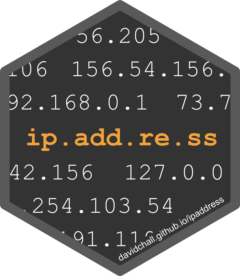

<!-- README.md is generated from README.Rmd. Please edit that file -->

```{r, include = FALSE}
knitr::opts_chunk$set(
  collapse = TRUE,
  comment = "#>",
  fig.path = "man/figures/README-",
  out.width = "100%"
)
```

# ipaddress <a href='https://davidchall.github.io/ipaddress/'></a>

<!-- badges: start -->
[](https://CRAN.R-project.org/package=ipaddress)
[](https://github.com/davidchall/ipaddress/actions/workflows/R-CMD-check.yaml)
[](https://app.codecov.io/gh/davidchall/ipaddress?branch=master)
<!-- badges: end -->

ipaddress provides data classes and functions for working with IP addresses and networks. Its interface is inspired by the Python [ipaddress](https://docs.python.org/3/library/ipaddress.html) module.

Here are some key features:

* Functions to **generate and analyze IP data**
* Full support for both **IPv4 and IPv6** address spaces
* Data stored in native bit format for **reduced memory footprint**
* Calculations written in C++ for **fast performance**
* Compatible with the **tidyverse**

For data visualization of IP addresses and networks, check out the [ggip](https://davidchall.github.io/ggip/) package.


## Installation

Install the released version from [CRAN](https://CRAN.R-project.org) with:

``` r
install.packages("ipaddress")
```

Install the development version from [GitHub](https://github.com/) with:

``` r
# install.packages("remotes")
remotes::install_github("davidchall/ipaddress")
```


## Usage

Use `ip_address()` and `ip_network()` to create standalone vectors or data frame columns.

```{r example, message=FALSE}
library(tibble)
library(ipaddress)

address <- ip_address(c("192.168.0.1", "2001:db8::8a2e:370:7334"))
network <- ip_network(c("192.168.100.0/22", "2001:db8::/80"))

tibble(address, network)
```

It looks like we've simply stored the character vector, but we've actually validated each input and stored its native bit representation.
When the vector is displayed, the `print()` method formats each value back to the human-readable character representation.
There are two main advantages to storing IP data in their native bit representation:

* The data occupy less space in memory (up to 80% reduction),
* Subsequent use is much faster, since we don't repeatedly parse the character vector.

Read `vignette("ip-data")` to learn more about these vector classes.
For a demonstration of common recipes using ipaddress vectors and functions, see `vignette("recipes")`.


## Related work

* [**iptools**](https://hrbrmstr.github.io/iptools/) --  A well established R package for working with IP addresses and networks. Unfortunately IPv6 support is severely limited. Also, addresses and networks are stored as character vectors, so they must be parsed to their native bit representation for every operation. It served as an excellent guide and motivation for ipaddress.
* [**cyberpandas**](https://cyberpandas.readthedocs.io) -- A Python package for using IP addresses in a [pandas](https://pandas.pydata.org) DataFrame. This offers full support for IPv6 and stores addresses in the native bit representation. However, most "interesting" operations must deserialize each address to a Python [ipaddress](https://docs.python.org/3/library/ipaddress.html) object, which is slow. It also doesn't support IP networks.

---

Please note that the ipaddress project is released with a
[Contributor Code of Conduct](https://davidchall.github.io/ipaddress/CODE_OF_CONDUCT.html).
By contributing to this project, you agree to abide by its terms.
