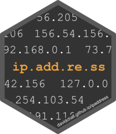

<!-- README.md is generated from README.Rmd. Please edit that file -->

# ipaddress <a href='https://davidchall.github.io/ipaddress/'></a>

<!-- badges: start -->

[](https://www.tidyverse.org/lifecycle/#maturing)
[](https://CRAN.R-project.org/package=ipaddress)
[](https://github.com/davidchall/ipaddress/actions)
[](https://codecov.io/gh/davidchall/ipaddress?branch=master)
<!-- badges: end -->

ipaddress provides data classes and functions for working with IP
addresses and networks. Its interface is inspired by the Python
[ipaddress](https://docs.python.org/3/library/ipaddress.html) module.

Here are some of the features:

  - Functions for **generation and analysis of IP data**
  - Full support for both **IPv4 and IPv6** address spaces
  - **Memory footprint:** data stored in native format
  - **Performance:** calculations performed in C++
  - Compatible with the **tidyverse**

For data visualization of IP addresses and networks, check out the
[ggip](https://davidchall.github.io/ggip/) package.

## Installation

You can install the released version of ipaddress from
[CRAN](https://CRAN.R-project.org) with:

``` r
install.packages("ipaddress")
```

Or you can install the development version from GitHub:

``` r
# install.packages("remotes")
remotes::install_github("davidchall/ipaddress")
```

## Usage

Use `ip_address()` and `ip_network()` vectors either standalone or as
columns in a data frame.

``` r
library(tidyverse)
library(ipaddress)

tibble(
  address = ip_address(c("192.168.0.1", "2001:db8::8a2e:370:7334")),
  network = ip_network(c("192.168.100.0/22", "2001:db8::/80"))
)
#> # A tibble: 2 x 2
#>                   address          network
#>                 <ip_addr>       <ip_netwk>
#> 1             192.168.0.1 192.168.100.0/22
#> 2 2001:db8::8a2e:370:7334    2001:db8::/80
```

Input character vectors are validated as they are parsed. Invalid inputs
raise a warning and are replaced with `NA`.

``` r
ip_address(c("255.255.255.255", "255.255.255.256"))
#> Warning: Problem on row 2: 255.255.255.256
#> <ip_address[2]>
#> [1] 255.255.255.255 <NA>
```

A variety of functions are provided to enable common tasks.

``` r
tibble(network = ip_network(c("192.168.100.0/22", "2001:db8::/80"))) %>%
  mutate(
    first = network_address(network),
    last = broadcast_address(network),
    ipv6 = is_ipv6(network)
  )
#> # A tibble: 2 x 4
#>            network         first                     last ipv6 
#>         <ip_netwk>     <ip_addr>                <ip_addr> <lgl>
#> 1 192.168.100.0/22 192.168.100.0          192.168.103.255 FALSE
#> 2    2001:db8::/80    2001:db8:: 2001:db8::ffff:ffff:ffff TRUE
```

## Related work

  - [**iptools**](https://hrbrmstr.github.io/iptools/) – A well
    established R package for working with IP addresses and networks.
    Unfortunately IPv6 support is severely limited. Also, addresses and
    networks are stored as character vectors, so they must be parsed to
    their native bit representation for every operation. It served as an
    excellent guide and motivation for ipaddress.
  - [**cyberpandas**](https://cyberpandas.readthedocs.io) – A Python
    package for using IP addresses in a
    [pandas](https://pandas.pydata.org) DataFrame. This offers full
    support for IPv6 and stores addresses in the native bit
    representation. However, most “interesting” operations must
    deserialize each address to a Python
    [ipaddress](https://docs.python.org/3/library/ipaddress.html)
    object, which is slow. It also doesn’t support IP networks.

-----

Please note that the ipaddress project is released with a [Contributor
Code of
Conduct](https://davidchall.github.io/ipaddress/CODE_OF_CONDUCT.html).
By contributing to this project, you agree to abide by its terms.
