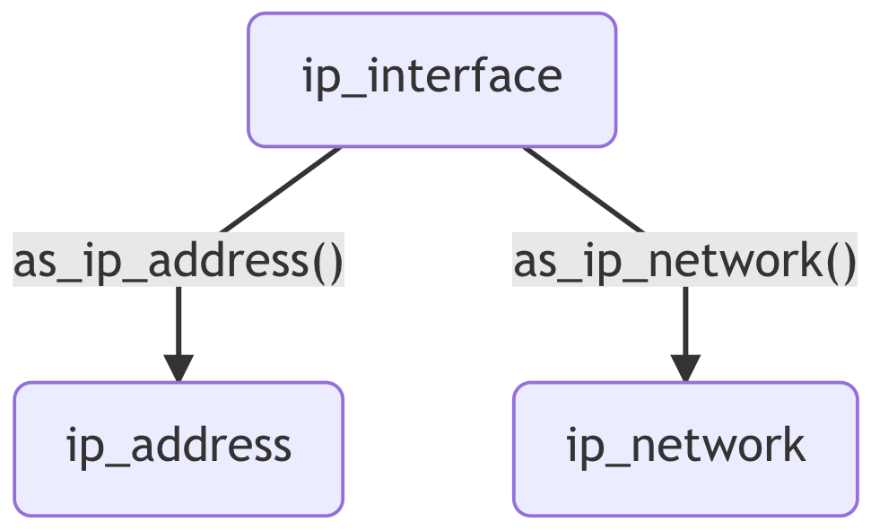

```{r, include = FALSE}
knitr::opts_chunk$set(
  collapse = TRUE,
  comment = "#>"
)
```

```{r setup, include = FALSE}
library(ipaddress)
```

The ipaddress R package was heavily influenced by the design of the [ipaddress](https://docs.python.org/3/library/ipaddress.html) module in the Python Standard Library.
For this reason, the package is centered around 3 data classes: `ip_address()`, `ip_network()` and `ip_interface()`.

This vignette is styled after the [official tutorial](https://docs.python.org/3/howto/ipaddress.html) for the Python module.
It introduces you to these classes, laying the groundwork for the rest of the package functionality.


## IP Addresses

### Background

IP addresses are used to facilitate communications between computers connected to the internet.
At this highest level, an IP address is analogous to a mailing address.

It's important to know there are two versions of the Internet Protocol in wide usage today.
IPv4 stores addresses using 32 bits, which provides `r format(2^32, big.mark = ",")` unique addresses.
But given the rapid growth of the internet, this address space was quickly depleted.
The replacement protocol (known as IPv6) stores addresses using 128 bits, which provides a far greater number of unique addresses (sufficient for the foreseeable future).
The transition to IPv6 is currently ongoing, so it is still very common to see IPv4 addresses.

To make IP addresses easier for humans to interpret, they are usually represented as character strings.

* An IPv4 address is represented as 4 groups of decimal numbers from `0` to `255` separated by periods (e.g. `192.168.0.1`). Each group corresponds to 8 bits.
* An IPv6 address is represented as 8 groups of hexadecimal numbers from `0000` to `ffff` separated by colons (e.g. `2001:0db8:85a3:0000:0000:8a2e:0370:7334`). Each group corresponds to 16 bits. This representation can also be compressed by removing leading zeros and replacing consecutive groups of zeros with double-colon (e.g. `2001:db8:85a3::8a2e:370:7334`).

### Class constructor

An `ip_address()` vector is constructed from a character vector of these human-readable strings.
It can handle IPv4 and IPv6 addresses simultaneously:

```{r}
ip_address(c("192.168.0.1", "2001:db8::8a2e:370:7334"))
```

IP addresses are often stored as integers for convenience, so you might need to encode or decode this format.
The `ip_to_integer()` and `integer_to_ip()` functions are provided for this purpose.
We recommend reading the documentation before use, because these functions can be slightly counter-intuitive (due to circumventing limitations of the R integer data type).

### Data storage

The above example looks like we've simply stored the character vector.
However, the constructor has actually validated each input and stored the native bit representation of each address.
The `print()` function has then converted them back to the human-readable character representation.
We can see this in action by passing an invalid address:

```{r}
ip_address("255.255.255.256")
```

There are two main advantages to storing IP data in their native bit representation:

* The data occupy less space in memory,
* Subsequent use is much faster, because we don't need to parse and validate the character vector again.


## IP Networks

### Background

An IP network is a contiguous range of IP addresses (also known as an IP block).
These networks are very important to how address allocation and routing work.

The size of a network is determined by its _prefix length_.
This indicates how many bits are reserved (counting from the left) for the routing prefix address (i.e. the start of the address range).
The remaining bits are available for allocation to hosts (so all hosts on a network will share the same prefix bits).
This means a network with a larger prefix length is actually a smaller network.

The most common representation of an IP network is called CIDR notation.
This shows the routing prefix address and the prefix length, separated by a forward slash.
This notation is used by both IPv4 and IPv6 networks.

As an example, the `192.168.0.0/24` network represents the address range from `192.168.0.0` to `192.168.0.255`.

### Class constructor

An `ip_network()` vector is constructed from a character vector of these CIDR strings.
For example:

```{r}
ip_network(c("192.168.0.0/24", "2001:db8::/48"))
```

An IP network cannot have any host bits set.
If host bits were set, this would refer to a specific host on the network and not the network as a whole -- this is the purpose of the `ip_interface()` class (see below).

The `ip_network()` constructor enforces this rule during input validation.
If an input has host bits set, a warning is emitted and `NA` is returned.
However, you can mask out the host bits using `strict = FALSE`.

```{r}
ip_network("192.168.0.1/24")

ip_network("192.168.0.1/24", strict = FALSE)
```


## IP Interfaces

### Background

We've learned about host addresses and how they are grouped into networks.
Unsurprisingly then, people often think about an IP address within the context of its network (i.e. storing both pieces of information simultaneously).
The ipaddress package refers to this concept as an IP interface.

An IP interface could be represented in many different ways (e.g. two addresses containing the network bits and host bits separately).
However, the most common representation is CIDR notation again.

### Class constructor

An `ip_interface()` vector is constructed from a character vector of CIDR strings, just like an `ip_network()` vector.
However, unlike `ip_network()`, the `ip_interface()` class retains the host bits.

```{r}
ip_interface(c("192.168.0.1/10", "2001:db8:c3::abcd/45"))
```

Since this class represents a host on a specific network, most functions will treat an `ip_interface()` vector like an `ip_address()` vector.
Some exceptions are listed under `help(ip_interface)`.

The address and network components can be extracted using the `as_ip_address()` and `as_ip_network()` functions, respectively.

```{r}
x <- ip_interface(c("192.168.0.1/10", "2001:db8:c3::abcd/45"))

as_ip_address(x)

as_ip_network(x)
```


## Summary

The ipaddress package provides the `ip_address()` and `ip_network()` data classes, which represent the most fundamental aspects of IP networking.
The majority of functions contained in this package use these classes.

An `ip_interface()` class is also provided, which is a hybrid class describing a specific host on a specific network.
Although most functions treat this class like an `ip_address()`, the constituent address and network components can be extracted using `as_ip_address()` and `as_ip_network()`.

```{r, echo = FALSE, fig.cap="Summary of ipaddress classes"}

```
